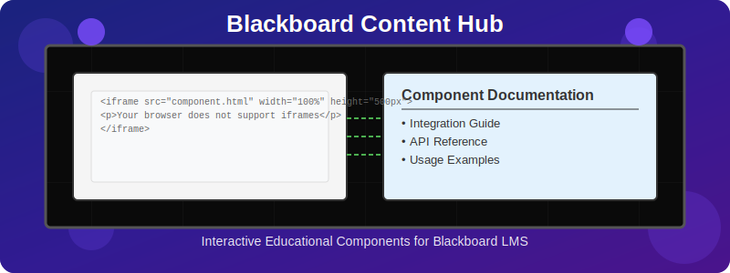

<div align="center">
  
  <p><em>Interactive educational components with seamless documentation for Blackboard LMS</em></p>
</div>

# Blackboard Content Hub

A comprehensive platform for creating, hosting, and documenting interactive educational content as iframes for embedding in Blackboard LMS.

## ✨ Nascent Digital Dawn

The platform features our new "Nascent Digital Dawn" design theme, characterized by:

- Deep indigo backgrounds with electric magenta accents
- Animated ember particles creating a dynamic, engaging experience
- Modern typography with Rajdhani and Open Sans fonts
- Responsive design that works beautifully on all devices
- Immersive iframe showcase with intuitive navigation

## 🎯 Overview

The Blackboard Content Hub provides a structured framework for developing and hosting interactive educational components that can be embedded in Blackboard courses. The project is designed to:

- 🏢 Organize content by category (general, research, courses)
- 🔄 Support both shared and course-specific components
- 📚 Provide comprehensive documentation
- 🚀 Optimize for GitHub Pages hosting
- 🔌 Facilitate easy embedding in Blackboard

## 🗂️ Project Structure

```
blackboard-content-hub/
├── .agent/                  # AI assistant knowledge base
│   ├── issues/              # Documented issues and solutions
│   ├── knowledge-base/      # Reusable solutions and patterns
│   └── templates/           # Templates for tracking issues
├── assets/                  # Static assets
│   ├── images/              # Images for components
│   │   └── banner/          # Banner animation images
│   ├── fonts/               # Custom fonts
│   ├── css/                 # CSS for animations
│   ├── js/                  # JavaScript for animations
│   └── documents/           # PDF and other documents
├── build/                   # Build scripts and configuration
├── courses/                 # Course-specific components
│   ├── math-a151/           # College Algebra
│   ├── math-a152/           # Trigonometry
│   ├── math-a221/           # Applied Calculus
│   ├── math-a251/           # Calculus I
│   ├── math-a252/           # Calculus II
│   ├── math-a253/           # Calculus III
│   └── stat-a253/           # Applied Statistics
├── docs/                    # Documentation (Jekyll site)
│   ├── user-guide/          # End-user documentation
│   ├── developer-guide/     # Technical documentation
│   ├── troubleshooting/     # Common issues and solutions
│   ├── component-browser/   # Interactive component browser
│   └── courses/             # Course-specific pages
├── shared/                  # Shared resources
│   ├── components/          # Shared components
│   ├── libraries/           # Shared libraries
│   ├── scripts/             # Shared JavaScript
│   └── styles/              # Shared CSS
│       ├── theme-variables.css    # Theme variables
│       ├── theme-base.css         # Base styles
│       ├── theme-components.css   # Component styles
│       ├── theme-animations.css   # Animation styles
│       └── theme-responsive.css   # Responsive styles
└── tools/                   # Development tools
```

## 📖 Documentation

Comprehensive documentation is available at: [https://jjohnson-47.github.io/blackboard-content-hub/](https://jjohnson-47.github.io/blackboard-content-hub/)

The documentation includes:

| Section | Description |
|---------|-------------|
| **[User Guide](https://jjohnson-47.github.io/blackboard-content-hub/user-guide/)** | Instructions for creating and embedding components |
| **[Developer Guide](https://jjohnson-47.github.io/blackboard-content-hub/developer-guide/)** | Technical documentation for developers |
| **[Component Browser](https://jjohnson-47.github.io/blackboard-content-hub/component-browser/)** | Interactive browser for all available components |
| **[Courses](https://jjohnson-47.github.io/blackboard-content-hub/courses/)** | Course-specific components |
| **[Troubleshooting](https://jjohnson-47.github.io/blackboard-content-hub/troubleshooting/)** | Solutions to common issues |

## 🚀 Getting Started

### Prerequisites

- Node.js (v18 or higher)
- npm (v8 or higher)
- Git
- Ruby and Jekyll (for local documentation development)

### Installation

1. Clone the repository:
   ```bash
   git clone https://github.com/jjohnson-47/blackboard-content-hub.git
   cd blackboard-content-hub
   ```

2. Install dependencies:
   ```bash
   npm install
   ```

3. Start the documentation site locally:
   ```bash
   npm start
   ```

### Creating a New Component

Use the component creation tool:

```bash
npm run new:component
```

Follow the prompts to create either a shared or course-specific component.

### Creating a New Course

Use the course creation tool:

```bash
npm run new:course
```

This will create the necessary directory structure and configuration files for a new course.

### Building and Deploying

Build the project:

```bash
npm run build
```

Deploy to GitHub Pages:

```bash
npm run deploy
```

## 🤝 Contributing

Contributions are welcome! Please see the [Contributing Guide](https://jjohnson-47.github.io/blackboard-content-hub/contributing/) for details.

## 📄 License

This project is licensed under the MIT License - see the [LICENSE](LICENSE) file for details.
