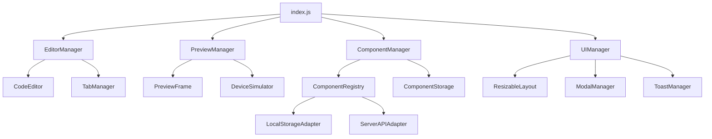

# Component Manager Modularization Plan

This document outlines the comprehensive plan for modularizing the Component Manager and enhancing its functionality.

## Overview

The Component Manager is being refactored to address several issues:

1. **Code Organization**: The editor.js file has grown too large, making it difficult to maintain and extend.
2. **Missing Functionality**: The ability to resize between the editor pane and preview pane is needed.
3. **Component Preservation**: Need to ensure components with special functionality (like Desmos API) are properly preserved.
4. **Component Deletion**: Need to implement proper component deletion functionality.

## Proposed Architecture

## Module Structure

### Core Modules

1. **index.js**
   - Main entry point
   - Initializes all managers
   - Coordinates communication between modules

2. **EditorManager.js**
   - Manages the code editor
   - Handles tab switching (HTML, CSS, JS)
   - Manages code formatting
   - Handles saving editor content

3. **PreviewManager.js**
   - Manages the preview iframe
   - Handles preview updates
   - Manages device simulation
   - Handles opening in new window

4. **ComponentManager.js**
   - Manages component operations (list, load, save, delete)
   - Handles component filtering and search
   - Manages component creation and promotion

5. **UIManager.js**
   - Manages UI elements and interactions
   - Handles modals and toasts
   - Manages the resizable layout
   - Handles theme switching

### Supporting Modules

6. **CodeEditor.js**
   - Wrapper for CodeMirror
   - Handles editor configuration
   - Manages syntax highlighting
   - Handles code validation

7. **TabManager.js**
   - Manages editor tabs
   - Handles tab switching
   - Manages tab content

8. **ComponentRegistry.js**
   - Client for the component registry
   - Handles component indexing
   - Manages component metadata

9. **ComponentStorage.js**
   - Handles localStorage operations
   - Manages component data persistence
   - Handles component versioning

10. **ResizableLayout.js**
    - Implements resizable panels
    - Handles drag-to-resize functionality
    - Manages layout persistence

11. **ModalManager.js**
    - Manages modal dialogs
    - Handles modal creation and destruction
    - Manages modal interactions

12. **ToastManager.js**
    - Manages toast notifications
    - Handles toast creation and destruction
    - Manages toast queuing

## Key Features

### Resizable Layout

The resizable layout feature will allow users to adjust the size of the editor and preview panes according to their preferences:

- Draggable divider between editor and preview panes
- Minimum size constraints for both panes
- Layout persistence (remember user's preferred sizes)
- Keyboard accessibility for resizing

### Component Deletion

The component deletion feature will allow users to delete components from the system:

- Confirmation dialog to prevent accidental deletion
- API endpoint for deletion
- Handling for both local and server-side components
- Visual feedback for deletion operations

### Component Preservation

Special handling for components with external dependencies:

- Preservation of "the-message" component with Desmos API functionality
- Version checking to prevent accidental overwrites
- Special handling for components with external dependencies

### Performance Improvements

Various performance improvements will be implemented:

- Lazy loading of modules
- Optimized component list rendering
- Efficient state management
- Reduced memory usage

## Implementation Phases

### Phase 1: Setup Module Structure

1. Create the module files with proper ES6 module syntax
2. Set up import/export relationships
3. Create a build process (if needed)
4. Update HTML to use the modular approach

### Phase 2: Implement Core Functionality

1. **EditorManager Implementation**
   - Extract editor functionality from editor.js
   - Implement tab management
   - Set up code formatting

2. **PreviewManager Implementation**
   - Extract preview functionality from editor.js
   - Implement device simulation
   - Set up preview updating

3. **ComponentManager Implementation**
   - Extract component management functionality from editor.js
   - Implement component loading/saving
   - Set up component filtering and search

4. **UIManager Implementation**
   - Extract UI functionality from editor.js
   - Implement modal and toast management
   - Set up event handling

### Phase 3: Implement Resizable Layout

1. **ResizableLayout Implementation**
   - Create a draggable divider between editor and preview
   - Implement mouse and touch event handling
   - Add minimum size constraints
   - Implement layout persistence

2. **CSS Updates**
   - Update the layout CSS to support resizing
   - Add styles for the resize handle
   - Ensure responsive behavior

3. **Accessibility Enhancements**
   - Add keyboard support for resizing
   - Ensure proper ARIA attributes
   - Add screen reader support

### Phase 4: Component Deletion and Preservation

1. **Component Deletion Implementation**
   - Implement confirmation dialog
   - Add deletion API endpoint
   - Handle local and server-side deletion

2. **Component Preservation**
   - Ensure "the-message" component is properly indexed
   - Add special handling for Desmos API components
   - Implement version checking

### Phase 5: Testing and Refinement

1. **Unit Testing**
   - Test each module independently
   - Verify module interactions
   - Test edge cases

2. **Integration Testing**
   - Test the complete system
   - Verify all features work together
   - Test with real components

3. **Performance Optimization**
   - Identify and fix performance bottlenecks
   - Optimize resource usage
   - Improve loading times

## Timeline and Milestones

1. **Week 1: Setup and Core Modules**
   - Create module structure
   - Implement EditorManager
   - Implement PreviewManager
   - Implement ComponentManager

2. **Week 2: UI and Resizable Layout**
   - Implement UIManager
   - Implement ResizableLayout
   - Update CSS for resizable panels
   - Add accessibility features

3. **Week 3: Component Features**
   - Implement component deletion
   - Ensure component preservation
   - Add component filtering
   - Implement component search

4. **Week 4: Testing and Refinement**
   - Test all features
   - Fix bugs
   - Optimize performance
   - Document the code

## Risks and Mitigations

1. **Risk**: Breaking existing functionality during refactoring
   - **Mitigation**: Implement comprehensive tests and refactor incrementally

2. **Risk**: Browser compatibility issues with resizable layout
   - **Mitigation**: Test across multiple browsers and implement fallbacks

3. **Risk**: Performance degradation with modular approach
   - **Mitigation**: Use code splitting and lazy loading where appropriate

4. **Risk**: Loss of component data during migration
   - **Mitigation**: Implement data migration and backup strategies