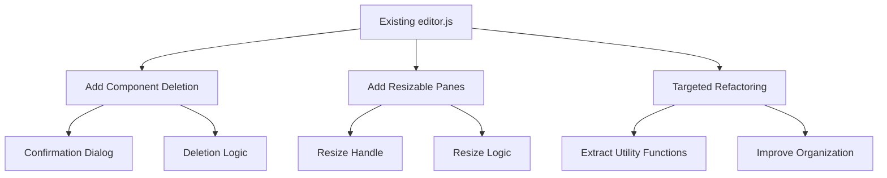

# Component Manager MVP Implementation Plan

This document outlines the Minimum Viable Product (MVP) approach for enhancing the Component Manager with essential features while minimizing refactoring complexity.

## MVP Goals

1. **Add Component Deletion**: Implement the ability to delete components from the registry
2. **Add Resizable Panes**: Implement a resizable interface between editor and preview panes
3. **Minimal Refactoring**: Make targeted changes to the existing codebase without full modularization

## Implementation Approach



## 1. Component Deletion Implementation

### Step 1: Add Deletion UI
Add a delete button to each component in the list:

```javascript
// Add delete button to component list items
function renderComponentList() {
  // Existing code...
  
  this.filteredComponents.forEach(component => {
    // Existing code...
    
    // Add delete button
    const deleteButton = `<button class="component-delete-btn" title="Delete component" data-id="${component.id}">
      <span class="material-icons">delete</span>
    </button>`;
    
    a.innerHTML = `
      <span class="material-icons component-icon">${iconName}</span>
      <div class="component-info">
        <span class="component-name">${component.title}</span>
        ${locationBadge}
        ${dateInfo}
      </div>
      ${deleteButton}
    `;
    
    // Add click event for delete button
    a.querySelector('.component-delete-btn').addEventListener('click', (e) => {
      e.preventDefault();
      e.stopPropagation();
      this.confirmDeleteComponent(component);
    });
    
    // Existing code...
  });
}
```

### Step 2: Add Confirmation Dialog
Create a simple confirmation dialog for deletion:

```javascript
// Create delete confirmation modal if it doesn't exist
function createDeleteModal() {
  const modal = document.createElement('div');
  modal.id = 'deleteModal';
  modal.className = 'modal';
  
  modal.innerHTML = `
    <div class="modal-content">
      <div class="modal-header">
        <div class="modal-title">Delete Component</div>
        <button class="modal-close" id="closeDeleteModal">&times;</button>
      </div>
      <div class="modal-body">
        <p>Are you sure you want to delete this component?</p>
        <p class="text-danger">This action cannot be undone.</p>
        <p id="deleteComponentName" class="font-weight-bold"></p>
      </div>
      <div class="modal-footer">
        <button class="btn btn-outline" id="cancelDelete">Cancel</button>
        <button class="btn btn-danger" id="confirmDelete">Delete</button>
      </div>
    </div>
  `;
  
  document.body.appendChild(modal);
  
  // Add event listeners
  document.getElementById('closeDeleteModal').addEventListener('click', () => {
    this.closeModal(modal);
  });
  
  document.getElementById('cancelDelete').addEventListener('click', () => {
    this.closeModal(modal);
  });
  
  document.getElementById('confirmDelete').addEventListener('click', () => {
    this.deleteComponent(this.componentToDelete);
    this.closeModal(modal);
  });
  
  return modal;
}
```

### Step 3: Implement Deletion Logic
Add the deletion logic to the component registry client:

```javascript
// Delete component
async function deleteComponent(component) {
  if (!component) return;
  
  try {
    // For local components, remove from localStorage
    if (component.locationType === 'local') {
      localStorage.removeItem(`component_${component.id}`);
      
      // Update projects list
      const storedProjects = localStorage.getItem('projectsList');
      if (storedProjects) {
        const projects = JSON.parse(storedProjects);
        const updatedProjects = projects.filter(p => p.id !== component.id);
        localStorage.setItem('projectsList', JSON.stringify(updatedProjects));
      }
      
      // Show success message
      this.showToast('success', 'Deleted', `Component ${component.title} deleted successfully`);
      
      // Refresh component list
      this.loadComponentList();
      return;
    }
    
    // For other components, call the API
    const response = await fetch(`/api/components/${component.id}`, {
      method: 'DELETE'
    });
    
    if (response.ok) {
      // Show success message
      this.showToast('success', 'Deleted', `Component ${component.title} deleted successfully`);
      
      // If the deleted component is the current component, clear editor
      if (this.currentComponent && this.currentComponent.id === component.id) {
        this.currentComponent = null;
        this.htmlCode = '';
        this.cssCode = '';
        this.jsCode = '';
        this.editor.setValue('');
        this.updateStatusMessage('Component deleted');
      }
      
      // Refresh component list
      this.loadComponentList();
    } else {
      this.showToast('error', 'Error', `Failed to delete component ${component.title}`);
    }
  } catch (error) {
    console.error('Error deleting component:', error);
    this.showToast('error', 'Error', `Error deleting component: ${error.message}`);
  }
}
```

## 2. Resizable Panes Implementation

### Step 1: Add CSS for Resizable Layout
Add CSS for the resizable layout:

```css
/* Add to existing CSS */
.editor-preview-container {
  display: flex;
  width: 100%;
  height: 100%;
  overflow: hidden;
}

.editor-container {
  flex: 1;
  min-width: 200px;
  overflow: hidden;
  transition: width 0.1s ease;
}

.resize-handle {
  width: 8px;
  background-color: #e0e0e0;
  cursor: col-resize;
  position: relative;
  z-index: 10;
}

.resize-handle:hover, 
.resize-handle:focus {
  background-color: #7b1fa2;
}

.resize-handle::after {
  content: "";
  position: absolute;
  top: 50%;
  left: 50%;
  transform: translate(-50%, -50%);
  width: 2px;
  height: 30px;
  background-color: #999;
  border-radius: 1px;
}

.preview-container {
  flex: 1;
  min-width: 200px;
  overflow: hidden;
  transition: width 0.1s ease;
}

body.resizing {
  cursor: col-resize;
  user-select: none;
}

body.resizing iframe {
  pointer-events: none;
}
```

### Step 2: Update HTML Structure
Update the HTML structure to support resizable panes:

```html
<!-- Replace existing structure with this -->
<div class="editor-preview-container">
  <div class="editor-container" id="editorContainer">
    <!-- Editor tabs and content -->
    <div class="editor-tabs">
      <!-- Tab buttons -->
    </div>
    <div class="editor-content">
      <textarea id="codeEditor"></textarea>
    </div>
  </div>
  
  <div class="resize-handle" id="resizeHandle" role="separator" aria-orientation="vertical" tabindex="0"></div>
  
  <div class="preview-container" id="previewContainer">
    <!-- Preview frame and controls -->
    <div class="preview-controls">
      <!-- Device buttons -->
    </div>
    <div class="preview-frame-container">
      <iframe id="previewFrame" sandbox="allow-scripts allow-same-origin"></iframe>
    </div>
  </div>
</div>
```

### Step 3: Implement Resize Functionality
Add JavaScript for the resize functionality:

```javascript
// Initialize resizable layout
function initResizableLayout() {
  const container = document.querySelector('.editor-preview-container');
  const leftPanel = document.getElementById('editorContainer');
  const rightPanel = document.getElementById('previewContainer');
  const handle = document.getElementById('resizeHandle');
  
  if (!container || !leftPanel || !rightPanel || !handle) {
    console.warn('Resizable layout elements not found');
    return;
  }
  
  // Load saved state
  loadLayoutState();
  
  // Variables for resize operation
  let isResizing = false;
  let initialX = 0;
  let initialLeftWidth = 0;
  
  // Mouse events
  handle.addEventListener('mousedown', startResize);
  
  // Keyboard events
  handle.addEventListener('keydown', handleKeyDown);
  
  // Touch events
  handle.addEventListener('touchstart', startResize, { passive: false });
  
  // Window resize
  window.addEventListener('resize', handleWindowResize);
  
  function startResize(e) {
    e.preventDefault();
    
    // Store initial positions
    initialX = e.clientX || e.touches[0].clientX;
    initialLeftWidth = leftPanel.getBoundingClientRect().width;
    
    // Add event listeners
    document.addEventListener('mousemove', resize);
    document.addEventListener('mouseup', stopResize);
    document.addEventListener('touchmove', resize, { passive: false });
    document.addEventListener('touchend', stopResize);
    
    // Add resizing class
    document.body.classList.add('resizing');
    isResizing = true;
  }
  
  function resize(e) {
    if (!isResizing) return;
    
    e.preventDefault();
    
    const clientX = e.clientX || e.touches[0].clientX;
    const deltaX = clientX - initialX;
    
    // Calculate new width
    let newLeftWidth = initialLeftWidth + deltaX;
    
    // Apply constraints
    const containerWidth = container.clientWidth;
    const minLeftWidth = 200;
    const minRightWidth = 200;
    
    newLeftWidth = Math.max(minLeftWidth, Math.min(newLeftWidth, containerWidth - minRightWidth - handle.offsetWidth));
    
    // Update panel widths
    leftPanel.style.width = `${newLeftWidth}px`;
    rightPanel.style.width = `${containerWidth - newLeftWidth - handle.offsetWidth}px`;
    
    // Update ARIA attributes
    handle.setAttribute('aria-valuenow', newLeftWidth);
  }
  
  function stopResize() {
    if (!isResizing) return;
    
    // Remove event listeners
    document.removeEventListener('mousemove', resize);
    document.removeEventListener('mouseup', stopResize);
    document.removeEventListener('touchmove', resize);
    document.removeEventListener('touchend', stopResize);
    
    // Remove resizing class
    document.body.classList.remove('resizing');
    isResizing = false;
    
    // Save state
    saveLayoutState();
  }
  
  function handleKeyDown(e) {
    let newLeftWidth = leftPanel.getBoundingClientRect().width;
    
    switch (e.key) {
      case 'ArrowLeft':
        newLeftWidth -= 10;
        break;
      case 'ArrowRight':
        newLeftWidth += 10;
        break;
      default:
        return;
    }
    
    // Apply constraints
    const containerWidth = container.clientWidth;
    const minLeftWidth = 200;
    const minRightWidth = 200;
    
    newLeftWidth = Math.max(minLeftWidth, Math.min(newLeftWidth, containerWidth - minRightWidth - handle.offsetWidth));
    
    // Update panel widths
    leftPanel.style.width = `${newLeftWidth}px`;
    rightPanel.style.width = `${containerWidth - newLeftWidth - handle.offsetWidth}px`;
    
    // Update ARIA attributes
    handle.setAttribute('aria-valuenow', newLeftWidth);
    
    // Save state
    saveLayoutState();
  }
  
  function handleWindowResize() {
    // Recalculate panel widths on window resize
    const containerWidth = container.clientWidth;
    const leftWidth = leftPanel.getBoundingClientRect().width;
    const handleWidth = handle.offsetWidth;
    const minLeftWidth = 200;
    const minRightWidth = 200;
    
    // Ensure constraints are still met
    if (leftWidth < minLeftWidth) {
      leftPanel.style.width = `${minLeftWidth}px`;
      rightPanel.style.width = `${containerWidth - minLeftWidth - handleWidth}px`;
    } else if (containerWidth - leftWidth - handleWidth < minRightWidth) {
      const newLeftWidth = containerWidth - minRightWidth - handleWidth;
      leftPanel.style.width = `${newLeftWidth}px`;
      rightPanel.style.width = `${minRightWidth}px`;
    }
    
    // Update ARIA attributes
    handle.setAttribute('aria-valuemax', containerWidth - minRightWidth);
    handle.setAttribute('aria-valuenow', leftPanel.getBoundingClientRect().width);
  }
  
  function saveLayoutState() {
    const state = {
      leftWidth: leftPanel.getBoundingClientRect().width,
      rightWidth: rightPanel.getBoundingClientRect().width
    };
    
    localStorage.setItem('resizable-layout-state', JSON.stringify(state));
  }
  
  function loadLayoutState() {
    const savedState = localStorage.getItem('resizable-layout-state');
    
    if (savedState) {
      try {
        const state = JSON.parse(savedState);
        const containerWidth = container.clientWidth;
        const handleWidth = handle.offsetWidth;
        const minLeftWidth = 200;
        const minRightWidth = 200;
        
        // Ensure the saved state is still valid
        if (state.leftWidth >= minLeftWidth && 
            state.rightWidth >= minRightWidth && 
            state.leftWidth + state.rightWidth + handleWidth <= containerWidth) {
          leftPanel.style.width = `${state.leftWidth}px`;
          rightPanel.style.width = `${state.rightWidth}px`;
        }
      } catch (error) {
        console.error('Error loading layout state:', error);
      }
    }
  }
}
```

## 3. Targeted Refactoring

### Step 1: Extract Utility Functions
Extract common utility functions to improve organization:

```javascript
// Toast notification utility
function showToast(type, title, message, duration = 3000) {
  const toast = document.getElementById('toast');
  const toastTitle = document.getElementById('toastTitle');
  const toastMessage = document.getElementById('toastMessage');
  const toastIcon = document.getElementById('toastIcon');
  
  toast.className = `toast active toast-${type}`;
  toastTitle.textContent = title;
  toastMessage.textContent = message;
  
  switch (type) {
    case 'success':
      toastIcon.textContent = 'check_circle';
      break;
    case 'error':
      toastIcon.textContent = 'error';
      break;
    case 'info':
      toastIcon.textContent = 'info';
      break;
    case 'warning':
      toastIcon.textContent = 'warning';
      break;
  }
  
  setTimeout(() => {
    toast.className = 'toast';
  }, duration);
}

// Modal utilities
function openModal(modal) {
  modal.classList.add('active');
}

function closeModal(modal) {
  modal.classList.remove('active');
}
```

### Step 2: Improve Organization
Reorganize the existing code to group related functionality:

```javascript
// Group related functionality
class DevPreview {
  constructor() {
    this.initElements();
    this.initState();
    this.initEditor();
    this.initComponentRegistry();
    this.initResizableLayout();
    this.attachEventListeners();
    this.loadComponentList();
  }
  
  // UI Elements
  initElements() { /* ... */ }
  
  // State Management
  initState() { /* ... */ }
  
  // Editor Management
  initEditor() { /* ... */ }
  setActiveTab(tab) { /* ... */ }
  saveCurrentTabContent() { /* ... */ }
  formatCode() { /* ... */ }
  
  // Preview Management
  updatePreview() { /* ... */ }
  openInNewWindow() { /* ... */ }
  
  // Component Management
  initComponentRegistry() { /* ... */ }
  loadComponentList() { /* ... */ }
  filterComponents() { /* ... */ }
  renderComponentList() { /* ... */ }
  loadComponentByType(component) { /* ... */ }
  saveComponent() { /* ... */ }
  createComponent() { /* ... */ }
  
  // Component Deletion
  confirmDeleteComponent(component) { /* ... */ }
  deleteComponent(component) { /* ... */ }
  
  // Resizable Layout
  initResizableLayout() { /* ... */ }
  
  // Event Handling
  attachEventListeners() { /* ... */ }
  
  // UI Utilities
  showToast(type, title, message) { /* ... */ }
  openModal(modal) { /* ... */ }
  closeModal(modal) { /* ... */ }
  updateStatusMessage(message) { /* ... */ }
}
```

## Implementation Timeline

1. **Day 1: Component Deletion**
   - Add delete button to component list items
   - Create confirmation dialog
   - Implement deletion logic
   - Test deletion functionality

2. **Day 2: Resizable Layout**
   - Add CSS for resizable layout
   - Update HTML structure
   - Implement resize functionality
   - Test resizing behavior

3. **Day 3: Refactoring and Testing**
   - Extract utility functions
   - Improve code organization
   - Test all functionality
   - Fix any bugs

## Conclusion

This MVP approach focuses on adding the most important features (component deletion and resizable panes) while making minimal changes to the existing codebase. This approach allows for quick implementation while still improving the user experience significantly.

The more comprehensive modularization plan can be implemented in a future phase when more time is available.